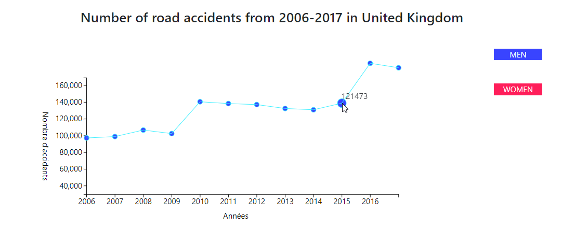

# Data visualisation

The aim of this projet is to build data interactive charts using [D3](https://d3js.org/) javascript library. 


### Structure

- css/ (Bootstrap dependecies)
- data/ (Data that will be displaying)
- js/ (Bootstrap | d3 | jquery | popper  dependecies)
- pages/ (charts)
- screenshots/ 
- index.html (Home page)

## Sharing
Project is open source. Feel free to make your own version. And strat interacting with data. All you need to do is to fork this repository.

## Prerequisites and Installation  

Will need to have a running local server.
If you do not have a local server. You can create one rapidly using python, in the root of this project run : 
```python
python -m http.server 8000
```
Congrat !! you have a local server running in port *8000*

In your browser you can visit
 ```http
 localhost:8000
 ```

You will see : 


With the 2 buttons you can navigate to the two charts : 



## Maintenance

This project has been archived. Means that it is no longer actively maintained by developer. Free free to fork, use and maintain your own version.

